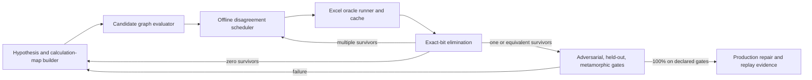

# Excel Discrepancy Smart Search And Active-Learning Loop

Status: `active_methodology`

Last updated: `2026-08-09`

Purpose: define the durable clean-room method for identifying the exact
calculation graph behind an Excel-observable result and converting that
identification into a bit-exact OxFunc repair with replayable evidence.

This document consolidates the discrepancy-reconciliation strategy, the W108
floating-point research, the W109 calculation-graph campaign, and the lessons
from successful and failed promotion attempts. It is a methodology document,
not a current discrepancy list. Current rows and their maturity remain in
[OXFUNC_EXCEL_DISCREPANCY_CATALOG.md](OXFUNC_EXCEL_DISCREPANCY_CATALOG.md).

## 1. Objective

For each discrepancy, identify the smallest plausible program that predicts
Excel's observable result over the declared version profile. "Program" means
more than a mathematical formula. It includes:

1. domain guards, coercions, branches, and special cases;
2. the algebraic expression tree and operation association;
3. the precision and instruction model used by each operation;
4. the locations where extended intermediates are stored and rounded;
5. exact constants and how they are loaded or derived;
6. accumulation direction and publication boundaries;
7. iterative method, seed, step, stopping rule, and published iterate;
8. error, type, sign-of-zero, overflow, underflow, and subnormal behavior.

The target is Excel's published behavior, not the mathematically nearest or
most accurate result. An analytically superior result that differs from Excel
is still an OxFunc discrepancy.

## 2. Governing Constraints

The work is strictly clean-room. Allowed inputs are public specifications,
published research, public implementations used as candidate families, and
reproducible black-box observations through Excel's public interfaces.
Disassembly, decompilation, binary inspection, dumping, or other inspection of
Excel or Microsoft-shipped binary internals is prohibited. When a search
reaches a wall, the next move is a better behavioral probe or a wider public
candidate family, never binary archaeology.

Every result is profile-scoped along both required version axes:

1. Excel application version, build, channel, architecture, and CPU-relevant
   execution profile;
2. workbook Compatibility Version.

Locale, date system, and host context are recorded whenever they can affect the
surface. A model identified on one profile is a strong hypothesis for another
profile, not evidence for it.

## 3. Reframe: Discrepancies Are Model-Identification Problems

The productive question is not "how can OxFunc become more accurate?" It is:

> Which calculation graph, executed under which historical floating-point
> model, produces exactly these Excel bits?

This reframing matters because a small result difference can come from very
different causes:

- a different algebraic identity;
- the same identity with a different association tree;
- one binary64 store barrier in a legacy x87 path;
- an x87 ROM constant instead of a binary64 source constant;
- forward rather than reverse accumulation;
- a branch threshold one representable value away;
- a solver returning an intermediate iterate rather than the nearest root;
- a dedicated legacy kernel rather than composition of worksheet-visible
  functions.

ULP distance helps describe a symptom. It does not identify a mechanism.

## 4. The Four-Part Search System



### 4.1 Excel oracle runner

The oracle runner evaluates typed inputs in live Excel, captures the typed
outcome, and records exact result bits. It must:

1. place every numeric input through `Range.Value2` and reference that cell
   from the formula;
2. preserve exact input bits in the case record;
3. capture numeric bits, worksheet error, value kind, shape, and sign of zero;
4. record Excel build, architecture, Compatibility Version, locale/profile,
   and the runner version;
5. batch calls to amortize workbook and recalculation overhead;
6. distinguish a function result from a harness, bind, or host failure.

Formula decimal literals are not a valid exact-input transport. Excel may
parse a long decimal to a neighboring binary64 value, creating a false
discrepancy. The binding rule and witness are in
[`smart-fuzzer/planning/EXCEL_RUNNER_PLUMBING_NOTE.md`](../smart-fuzzer/planning/EXCEL_RUNNER_PLUMBING_NOTE.md).

### 4.2 Persistent oracle cache

An Excel observation is expensive and must be reusable. Cache keys include at
least:

- function and surface identity;
- exact scalar and array argument bits, types, omissions, and ordering;
- result element when an array result is observed cell by cell;
- build/profile and CPU-relevant axis;
- Compatibility Version and other material context.

The current implementation is
[`smart-fuzzer/tools/OracleCache.psm1`](../smart-fuzzer/tools/OracleCache.psm1),
with build-sharded JSONL data. A cache hit prevents needless Excel work, but a
fresh live sign-off is still required before retiring a discrepancy.

Excel may be queried as much as the investigation needs. Information-guided
selection is an iteration-speed strategy, not an artificial evidence limit:
local candidates can be evaluated millions of times per live batch, and large
Excel batteries remain appropriate for validation, boundary mapping, and
sign-off.

### 4.3 Candidate calculation-graph evaluator

Candidates are data, not one-off source edits. The W109 DSL under
[`smart-fuzzer/tools/calc_graph_racer/`](../smart-fuzzer/tools/calc_graph_racer/)
supports expression graphs with per-node execution models. The conceptual
vocabulary should include:

- strict IEEE binary64 operations;
- x87 extended temporaries under explicit precision-control settings;
- explicit binary64 store barriers and double-rounding publication;
- raw historical instruction candidates where clean-room probes justify them;
- exact-bit binary64 constants and x87 ROM constants;
- branches and exact threshold constants;
- sum, product, and fold order;
- per-step-stored legacy accumulation;
- reusable identified substrates such as Excel's `POWER`, `EXP`, `LN`, and
  trig graphs;
- iterative nodes or a solver VM for recurrence and root-finding schedules.

Useful notation in evidence documents:

- `RN53(x)`: round a real or extended value to binary64;
- `RN64(x)`: round to the x87 64-bit-significand extended model;
- `DR(x) = RN53(RN64(x))`: legacy double-rounded store publication;
- `bits(x)`: the exact IEEE-754 binary64 bit pattern;
- `nextUp(x)` / `nextDown(x)`: adjacent representable values.

### 4.4 Experiment scheduler

The scheduler evaluates all surviving candidates cheaply over a large local
probe pool. It ranks probes by how strongly candidates disagree, then asks
Excel only the highest-information questions. The current W109 scheduler uses
the number of distinct predicted bit patterns; stronger schedulers may use:

1. expected entropy of the candidate partition;
2. worst-case survivor count;
3. balanced split quality;
4. novelty of branch, exponent, cancellation, or type bucket;
5. evaluation cost and risk of an unobservable/harness-invalid result;
6. coverage of model axes not previously separated;
7. cross-row leverage when a shared substrate is being identified.

## 5. The Calculation Map

Before searching a row, write a compact calculation map. It prevents blind
parameter sweeps and makes missing axes visible. At minimum it records:

| Field | Question |
|---|---|
| Surface | Which functions, aliases, branches, and result elements share the discrepancy? |
| Current graph | What exact graph does OxFunc execute today? |
| Structural hypotheses | Which identities, decompositions, recurrences, or public algorithm families are plausible? |
| Numeric model | Strict binary64, x87 continuous, stored x87, mixed model, or other published-era documented API behavior? |
| Constants | Binary64 bits, decimal conversion, reciprocal form, ROM constant, fitted table entry, or derived value? |
| Stores | Which intermediate assignments may publish to binary64? |
| Branches | What thresholds or predicates could divide the input domain? |
| Accumulation | Direction, grouping, compensation, and per-step storage? |
| Solver | Forward kernel, coordinate system, seed, perturbation, update, tolerance, cap, and publication rule? |
| Discriminators | Which constructed probes separate these hypotheses? |
| Evidence split | Which cases are discovery, adversarial, held-out, metamorphic, and live sign-off? |

The campaign seed map is
[`docs/function-lane/DISCREPANCY_CALCULATION_MAP.csv`](function-lane/DISCREPANCY_CALCULATION_MAP.csv).
It is a hypothesis surface, not an implementation or parity claim.

## 6. Search Dimensions, In Increasing Cost

Search should be layered. Do not begin by fitting thousands of coefficients if
a two-operation association change explains the bits.

### 6.1 Surface and structure

First determine guards, special cases, result kind, and broad identity:

- direct formula versus transformed formula;
- recurrence versus closed form;
- dedicated kernel versus composition through another substrate;
- symmetry and complement routing;
- integer-exponent or half-exponent dispatch;
- array traversal and result publication shape.

### 6.2 Association and reuse

Enumerate expression trees over the same operands. Also distinguish recomputing
an expression from storing and reusing it. TBILLYIELD was resolved by an
association difference, while YIELDMAT required identifying both grouping and
reuse of an intermediate.

### 6.3 Precision and store placement

For every meaningful node or block, consider:

- strict binary64;
- extended continuous evaluation;
- extended evaluation followed by a binary64 store;
- per-operation or per-loop-step store;
- mixed execution where a transcendental is extended but surrounding
  arithmetic is strict;
- precision-control choices when a public historical model supports them.

Store masks grow exponentially. Search them blockwise first, use beam search or
branch-and-bound, and only exhaust individual-node masks after constructed
probes have localized the sensitive block.

### 6.4 Instruction and constant choice

Candidates may differ in:

- `log`, `log1p`, `exp`, `expm1`, `pow`, or direct x87 instruction chains;
- `sqrt` dispatch versus `exp(y*ln(x))`;
- `FPREM` versus `FPREM1` reduction;
- table constants, exact bit constants, reciprocals, and x87 ROM constants;
- multiply-by-reciprocal versus divide;
- fused versus unfused or historical compiler-style sequences, where the
  platform model makes those candidates plausible.

Use public implementations as candidate generators, never as authority for
Excel. A public algorithm that matches many rows is still only a hypothesis
until independent Excel probes identify it.

### 6.5 Branch thresholds

Once different models win in different regions, search for a piecewise graph.
Use powers of two, adjacent binary64 values, and binary search to locate the
switch. Then probe both sides with inputs designed to make candidate bodies
diverge. A threshold is not identified merely because a fitted piecewise model
scores well; its predicate and exact constant need direct evidence.

### 6.6 Iteration and publication schedules

For iterative functions, the schedule is part of the function. Search:

- coordinate system and residual definition;
- seed and secondary seed;
- Newton, finite-difference Newton, secant, bisection, or hybrid update;
- perturbation direction and magnitude;
- derivative evaluation and store staging;
- residual versus step stopping predicate;
- strict versus non-strict comparison;
- iteration cap;
- last, stepped, previous, endpoint, midpoint, or best-residual publication.

## 7. Probe Design: Constructed Inputs Discover

Random inputs are useful for validation and coverage. Constructed inputs are
usually much better for identification.

### 7.1 Exact-arithmetic controls

Choose powers of two, small integers, exact ratios, exact roots, and cases where
most operations are exact in binary. This removes irrelevant rounding sites
and leaves one candidate operation observable.

### 7.2 Adjacent-value ladders

Probe `x`, `nextUp(x)`, and `nextDown(x)`, then wider ULP ladders. These expose
branch boundaries, rounding thresholds, solver basins, and discontinuities in
published iterates.

### 7.3 Double-rounding windows

Search cheaply offline for inputs where strict binary64 and an extended-then-
stored candidate differ. Ask Excel only those inputs. These windows were
decisive in the W109 NPER and XNPV searches.

### 7.4 Metamorphic transforms

Apply transformations that preserve the mathematical result but change an
implementation-sensitive path:

- reverse or permute input rows;
- scale all cash flows or observations;
- translate regression coordinates;
- split one term into two same-date or equal-value terms;
- add trailing zeros;
- exchange complementary probabilities;
- use sign symmetry, reciprocal identities, or aliases;
- reorder a matrix or apply exactly reversible row/column scaling.

If Excel's bits change, the transform identifies order, staging, or branch
dependence. If they do not, it eliminates entire candidate families.

### 7.5 Identity decomposition and intermediate isolation

Evaluate worksheet-visible pieces in separate cells and compare both:

1. the direct function;
2. a worksheet identity composed from published intermediates;
3. local candidates with intermediates continuous;
4. local candidates with those intermediates explicitly stored.

Agreement with the worksheet decomposition can identify a reused substrate, as
with XNPV and `POWER`. Disagreement is equally valuable: GROWTH showed that it
does not simply compose worksheet regression and `EXP` in the obvious way.

### 7.6 Implied intermediate and constant recovery

Choose inputs that allow an unknown factor or intermediate to be back-solved
from Excel's final bits. Repeating the recovery at several exact powers of two
can separate a stored binary64 constant from a direction-specific reciprocal or
extended constant. This is especially useful for unit conversions and simple
financial formulas.

### 7.7 Cancellation amplifiers

Construct cases where large terms nearly cancel. Tiny differences in operation
order or store placement then become large differences in the residual or
published root. Use these only after the broad graph is known; otherwise many
wrong models can appear to fit by accidental compensation.

### 7.8 Branch and domain probes

Probe zero, signed zero, subnormals, exact threshold values, adjacent values,
infinities only where the host accepts them, and both sides of every documented
or suspected domain guard. Capture error codes and value kinds, not only
numeric outputs.

## 8. Corpus Partitioning

Never search and sign off on the same undifferentiated corpus.

1. **Seed/reconnaissance set**: known discrepancies and compact controls.
2. **Discovery set**: may guide model choice, fitting, store-mask selection,
   and threshold search.
3. **Adversarial set**: generated specifically at double-rounding windows,
   branch edges, cancellation regions, and model disagreement points.
4. **Held-out set**: generated independently and never inspected during model
   selection. It detects compensation and overfitting.
5. **Metamorphic set**: paired or grouped cases whose mathematical relation is
   known and whose bit behavior diagnoses the implementation path.
6. **Doubt set**: periodically re-tests facts treated as settled, especially
   cache plumbing, shared substrates, and previously identified staging.
7. **Error/guard set**: non-numeric lanes and exact boundary behavior.
8. **Live sign-off set**: a fresh Excel sweep immediately before catalog
   retirement, including prior witnesses and independent coverage.

If a candidate family was tuned after observing the held-out set, that set is
no longer held out. Generate a fresh one.

## 9. The Active-Learning Loop

### 9.1 Step 1: triage and minimize

Confirm the mismatch through exact-input plumbing. Classify structural versus
numeric drift, minimize the witness without destroying the mismatch, and add
stable cases to the discrepancy evidence.

### 9.2 Step 2: build the hypothesis space

Write the current OxFunc graph and enumerate plausible alternatives by layers.
Reuse already identified substrates before inventing new primitives. Assign a
stable id and graph hash to each candidate so negative results remain durable.

### 9.3 Step 3: take free eliminations

Race every candidate against all cached witnesses and decomposition probes.
Remove exact-bit failures immediately. Structural mismatches outrank numeric
scores: a candidate returning the wrong kind or error is not "close."

### 9.4 Step 4: generate a large local probe pool

Generate thousands or millions of valid inputs locally. Bias the pool toward:

- candidate disagreement;
- exact controls and double-rounding windows;
- branch and exponent buckets;
- cancellation and conditioning buckets;
- metamorphic companions;
- underrepresented semantic or type lanes.

No Excel calls are required in this step.

### 9.5 Step 5: select the next Excel batch

Partition candidates by their predicted result for each probe. Rank probes by
information value and choose a diverse batch rather than many near-duplicates.
Include a few controls and doubt probes to detect runner or model regressions.

### 9.6 Step 6: query Excel once and cache

Evaluate the selected batch through typed cell references, persist exact
answers and profile metadata, and make the batch replayable. Do not manually
copy decimal display values into evidence.

### 9.7 Step 7: eliminate and diagnose

Kill every candidate that misses any answered case. Record its hash, the first
killing witness, expected bits, actual bits, and the model description in the
append-only elimination evidence and the ruled-out ledger.

- **Many survivors**: generate a pool focused on where those survivors differ.
- **Equivalent survivors**: try to find any input in the valid domain where
  they differ. If none exists because the axis is observationally irrelevant,
  record the equivalence and choose the simplest representative.
- **Zero survivors**: do not select the least-wrong model. The space is missing
  an axis. Inspect the first-kill patterns, extend structure/precision/branch/
  constant/schedule vocabulary, and replay all cached answers offline.

### 9.8 Step 8: validate without adapting

Freeze the candidate. Run adversarial, held-out, metamorphic, error/guard, and
wide random sweeps. A failure returns the row to hypothesis construction. Do
not patch isolated failures with unexplained ULP nudges.

### 9.9 Step 9: promote and sign off

Implement the identified graph in the shared substrate or function kernel,
add compact in-crate regression pins, replay the full corpus, perform a fresh
live Excel sign-off, update the calculation map and ruled-out ledger, and only
then remove the row from the live discrepancy catalog under the repository's
OPERATIONS closure rules.

The loop in pseudocode:

```text
survivors = generate_candidates(calculation_map)
answers   = cached_seed_and_recon_answers()

repeat:
    survivors = exact_bit_eliminate(survivors, answers)

    if survivors is empty:
        missing_axis = diagnose_first_kill_patterns(answers)
        survivors = extend_candidate_space(missing_axis)
        continue

    if survivors has one member or one proven-equivalent class:
        freeze_model(survivors)
        if independent_gates_are_all_exact(survivors):
            promote_with_replay_evidence(survivors)
            break
        survivors = extend_from_gate_failure(survivors)
        continue

    pool  = generate_constructed_probe_pool(survivors)
    batch = select_high_information_diverse_probes(pool, survivors)
    fresh = query_excel_through_value2_and_cache(batch)
    answers += fresh
```

## 10. Candidate Scoring

Use exact elimination whenever possible. For diagnostics and ranking, score
lexicographically:

1. fewest structural mismatches;
2. most exact-bit matches;
3. lowest maximum ULP distance;
4. lowest total or distributional residual, used only as a diagnostic;
5. lowest graph complexity;
6. stability across independent corpus partitions.

Average ULP must not be the primary objective. A model can achieve a better
average by compensating for two wrong operations, while the correct structural
model has a recognizable one-sided residual from one remaining primitive.

For fitted kernels, examine the residual as data:

- sign pattern by interval;
- exponent- or mantissa-correlated bands;
- discontinuities at suspected branch points;
- response to exact-zero anchors;
- scaling of error near roots or poles;
- whether one operation-tree change removes a deterministic residual pattern.

## 11. Fast Search Techniques

### 11.1 Enumerative graph search

Enumerate small expression trees, association variants, store masks, constant
choices, and known substrate nodes. Canonicalize commutative expressions and
deduplicate candidates by graph hash and observed prediction vector.

### 11.2 Beam search

For a large store-placement or operation-tree space, retain a diverse beam
based on exact count, worst miss, residual signature, and structural novelty.
Validate beam winners on a separate discovery subset before narrowing again.

### 11.3 Equality saturation or e-graph generation

Use algebraic rewrite rules to generate equivalent mathematical forms, then
attach execution models and store boundaries. This is a systematic way to
search reassociation without hand-writing every formula.

### 11.4 Constraint-guided constant recovery

Each Excel output constrains an unknown constant or coefficient to an interval
that rounds to the observed binary64 result. Intersect constraints from many
exact-control probes before nonlinear fitting. Search exact bit patterns or
small neighborhoods only after the feasible interval is narrow.

### 11.5 Residual-driven structural recovery

When a public algorithm family is close but not exact, avoid immediately
re-fitting coefficients. First test operation tree, centering, argument
reduction, precision, and publication. Coefficient fitting before the graph is
identified often absorbs the wrong operation staging and fails held-out.

### 11.6 Cross-row substrate search

Prefer probes that identify a primitive used by several rows: `EXP`, `LN`,
`POWER`, trig reduction, `GAMMALN`, incomplete gamma/beta, regression sums,
matrix elimination, day-count schedules, or a solver VM. A shared-substrate
repair has much higher leverage than a surface-specific patch.

### 11.7 Tooling palette

Use the tool that makes each layer fastest while keeping evidence reproducible:

- Rust or C for exact bit control, instruction microprobes, fast candidate
  evaluation, and production-shaped experiments;
- arbitrary-precision libraries for correctly rounded controls and for finding
  narrow rounding or cancellation windows;
- exact rationals and symbolic algebra for identity generation, simplification,
  exact-zero anchors, and back-solving intermediates;
- interval arithmetic or SMT/constraint tools for narrowing constants,
  thresholds, and coefficient bit ranges;
- numerical optimization for proposing coefficient families, followed by
  exact-bit and fresh-held-out rejection rather than fit-score acceptance;
- Python, R, or notebooks for residual plots, clustering, corpus analysis, and
  generating probe pools;
- batched Excel automation for oracle acquisition;
- documented public C APIs of published-era runtimes as candidate or control
  observations where provenance is clean and the API is public.

Tool agreement is not Excel evidence. Every winning implementation remains a
candidate until live Excel behavior identifies it, and no tool may be used to
inspect proprietary binary internals.

## 12. Family-Specific Playbooks

### 12.1 Closed-form and conversion functions

Start with all association trees, multiply-versus-divide choices, reciprocal
constants, and store points. Use exact powers of two to recover implied factors.
These are the best candidates for quick, decisive calculation-graph searches.

### 12.2 Transcendentals and trig

Search instruction family, argument reduction, ROM constants, quadrant/parity
dispatch, reciprocal staging, tiny-input branches, and final store. Large
arguments amplify reduction differences; tiny arguments expose special cases.
The W108/W109 x87 results are reusable substrates, not a license to assume all
functions use one global x87 graph.

### 12.3 Piecewise elementary functions

Map the domain densely enough to identify regions where candidate rankings
change. Bisect boundaries at the binary64 level. Search each body independently,
then test symmetry, sign, and boundary publication. The failed single-graph
ATANH attempt is the canonical warning: a candidate that matched 297/368 cases
still regressed 71 and was correctly rejected.

### 12.4 Special functions and distributions

Separate wrapper staging from the core approximation:

1. identify complement, symmetry, and scaling rules;
2. isolate exact parameter slices such as integers and half-integers;
3. identify branch families and thresholds;
4. race public algorithms under several operation models;
5. use direct CDF probes before reconstructing an inverse solver;
6. reconstruct inverse iteration only after the forward kernel is stable.

### 12.5 Regression and matrix functions

Use row reversal, translation, scaling, exact-linear data, pivot-forcing
matrices, and ill-conditioned cases. Separate the statistic or factorization
from the downstream distribution/publication function. For matrices, compare
entire result arrays and retain element coordinates in the cache key.

### 12.6 Financial schedules and recurrences

Separate date schedule/day count, discount-power substrate, cash-flow formula,
recurrence order, and accumulation/publication. Compare direct aggregate
functions with sums of individually published schedule rows. Probe type 0/1,
coupon boundaries, month ends, leap days, and exact par cases.

### 12.7 Root solvers

Identify the forward pricing, balance, or NPV kernel first. Then reconstruct
the solver as a trace-producing state machine. For each iteration record:

- current coordinate and published binary64 bits;
- function and derivative/finite-difference evaluations;
- step size and direction;
- proposed next point;
- bracket or endpoint state;
- stop predicate values;
- which iterate would be returned.

Use guess sweeps, one-step ladders around a known root, exact-root problems,
cash-flow scaling, adjacent target prices, and deliberately difficult basins.
Jointly score related functions when they plausibly share a solver family, but
allow their coordinates or publication rules to differ. Large ULP root errors
often reflect a different iteration path rather than a low-quality forward
kernel.

## 13. What The Existing Campaign Has Demonstrated

These examples justify the method and define reusable lessons:

- **TBILLYIELD**: exhaustive association search identified
  `((100-price)/price)*(360/days)`; the repair passed 2,156/2,156 live cases.
- **XNPV**: a 480-candidate search reached zero survivors, revealing missing
  integer-`POWER` dispatch and per-step-stored x87 accumulation axes. After
  extending the model, the identified graph passed 1,530 numeric and 175 error
  sign-off rows.
- **NPER**: high-information double-rounding-window probes separated strict
  and x87 spill-loop variants and pinned branch behavior.
- **Trig**: constructed large-argument and quadrant probes identified the
  reduction, ROM-constant, parity/quadrant, and reciprocal-publication graphs;
  all six functions passed the 5,425-case sign-off corpus.
- **ATANH**: a seemingly strong x87 half-log candidate failed the expanded
  corpus. This established the mandatory non-regression and held-out rule.
- **RATE/IRR and PMT-family work**: solver and cancellation lanes show why a
  high training score is not identification. Forward-kernel staging, solver
  schedule, and published iterate must be isolated rather than jointly fitted.

Detailed evidence remains in W109 function-lane reports and
[`docs/worksets/W109_ACTIVE_MODEL_DISCOVERY_CALC_GRAPH_SEARCH.md`](worksets/W109_ACTIVE_MODEL_DISCOVERY_CALC_GRAPH_SEARCH.md).

## 14. Failure Modes And Countermeasures

| Failure mode | Countermeasure |
|---|---|
| Decimal formula text changes the input | Use `Range.Value2`; store exact input bits. |
| A candidate wins by compensating errors | Inspect residual signatures and require fresh held-out exactness. |
| One identity is assumed globally | Search piecewise regions and exact thresholds. |
| The least-wrong candidate is selected after all candidates fail | Treat zero survivors as proof of a missing axis. |
| Random fuzzing produces many redundant Excel calls | Select offline where survivors disagree; cache every answer. |
| Store masks explode combinatorially | Localize sensitive blocks, then beam-search or exhaust only those blocks. |
| Coefficients absorb the wrong operation graph | Identify structure and staging before fitting constants. |
| Forward kernel and solver are fitted together | Pin the forward kernel independently, then trace the solver. |
| A discovery corpus is reused as validation | Maintain adversarial, held-out, metamorphic, doubt, and fresh sign-off sets. |
| A shared substrate is assumed from one surface | Re-probe through independent inheritors and decomposition identities. |
| A result is mathematically better than Excel | Match Excel and record the Excel imprecision witness. |
| Negative experiments are lost | Hash candidates and append killing witnesses to the ruled-out ledger. |
| Current status drifts from evidence | Update catalog, calculation map, bug stream, and sign-off record together. |

## 15. Per-Row Artifact Contract

Each active search should leave:

1. stable discrepancy id and minimized exact-input witnesses;
2. current calculation map;
3. candidate-space generator or persisted candidate JSON;
4. cached Excel answers with full profile metadata;
5. surviving-candidate state and append-only elimination records;
6. ruled-out ledger entries with graph hash and killing witness;
7. discovery/adversarial/held-out/metamorphic partition labels;
8. an identification report explaining the exact graph and alternatives;
9. production regression pins and a full-corpus replay verifier;
10. a fresh live sign-off record;
11. synchronized discrepancy catalog and bug-stream status.

High-volume passing cases can remain compact structured artifacts. Human prose
should focus on minimized failures, decisive discriminators, killed model
families, promotion rationale, and remaining uncertainty.

## 16. Search Prioritization

All discrepancies remain bugs, but search order should maximize expected
information and cross-row leverage. A useful priority score combines:

1. structural severity, then numeric magnitude and affected domain size;
2. probability that a bounded search can discriminate the current models;
3. number of downstream rows sharing the suspected substrate;
4. availability of exact controls and observable decompositions;
5. cost of generating and evaluating candidates;
6. risk that the lane is blocked on an unidentified primitive;
7. regression risk and difficulty of building a convincing held-out gate.

In practice:

- take cheap association, constant, guard, and publication wins first;
- identify shared numeric substrates before their inheritors;
- pin forward kernels before inverse solvers;
- use solver and custom special-function walls when the machinery developed
  there will transfer across several rows;
- periodically re-sweep the catalog after a shared primitive lands.

## 17. Promotion And Closure Discipline

A promising candidate is not a repair. Promotion requires:

1. one identified graph or a documented observationally equivalent class;
2. 100% exact behavior on the declared discovery, adversarial, held-out,
   metamorphic, guard, and fresh live sign-off gates;
3. no unexplained regression in the function's broader existing corpus;
4. production implementation through the appropriate shared substrate;
5. deterministic in-crate pins and replay tooling;
6. updated evidence, ruled-out ledger, catalog, bug stream, and version scope;
7. the Pre-Closure Verification Checklist in `OPERATIONS.md` Section 12;
8. the Completion Claim Self-Audit in `OPERATIONS.md` Section 14.

If any semantic lane remains open, status stays `in_progress` and reporting
uses `scope_partial`, `target_partial`, or `partial` as appropriate. Locale and
alternate-version validation remain explicit orthogonal lanes unless included
in the declared search scope.

## 18. Operational Checklist For The Next Search Round

1. Read the current catalog row, bug stream, calculation map, and ruled-out
   candidates.
2. Confirm exact-input Excel plumbing and reproduce the canonical witnesses.
3. Minimize and classify the mismatch.
4. Draw the current OxFunc graph, including every store and helper call.
5. Enumerate the smallest plausible model axes.
6. Take free eliminations against the oracle cache.
7. Construct a large local pool rich in disagreement and edge windows.
8. Query one diverse, high-information Excel batch.
9. Append eliminations; diagnose zero-survivor events as missing axes.
10. Repeat until one model or equivalent class survives.
11. Freeze it and run fresh independent gates without adapting.
12. Promote only after exact sign-off and repository closure checks.

The central habit is simple: make every Excel question discriminate explicit
models, and make every answer permanently reduce the search space.
